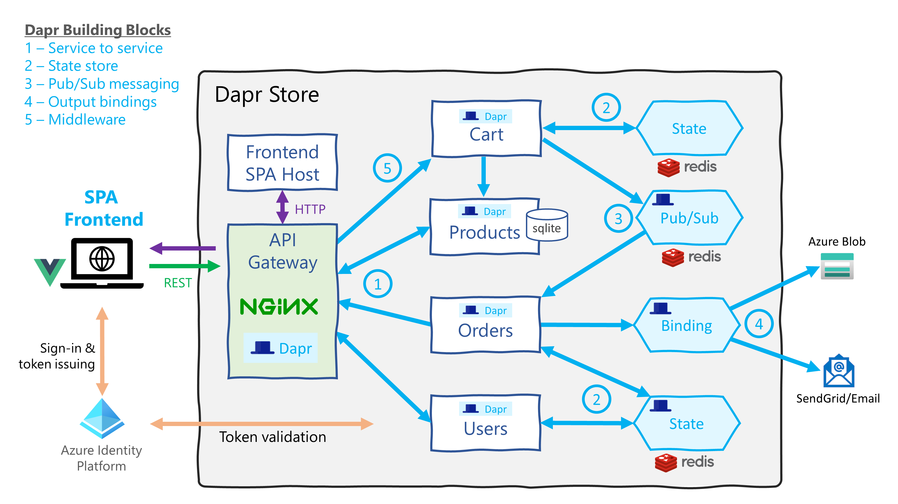

# Dapr Store

Dapr Store is a sample/reference application showcasing the use of [Dapr](https://dapr.io/) to build microservices based applications. It is a simple online store with all the core components that make up such system, e.g. a frontend for users, authentication, product catalog, and order processing etc.

[Dapr](https://dapr.io/) is an _"event-driven, portable runtime for building microservices on cloud and edge"_. The intention of this project was to show off many of the capabilities and features of Dapr, but in the context of a real working application. This has influenced the architecture and design decisions, balancing between realism and a simple _"demo-ware"_ showcase.

The backend microservices are written in Go (however it's worth nothing that Dapr is language independent), and the frontend is a single-page application (SPA) written in [Vue.js](https://vuejs.org/). All APIs are REST & HTTP based

This repo is a monorepo, containing the source for several discreet but closely linked codebases, one for each component of the project, as described below.  
The ["Go Standard Project Layout"](https://github.com/golang-standards/project-layout) has been used.

:warning: The project is still in the experimental stage, with a high rate of change - expect breaking changes

# Architecture

The following diagram shows all the components of the application and main interactions. It also highlights which Dapr API/feature (aka Dapr building block) is used and where.


## Dapr Interfaces & Building Blocks

The application uses the following [Dapr Building Blocks](https://github.com/dapr/docs/tree/master/concepts#building-blocks) and APIs

- **Service Invocation** — The API gateway calls the four main microservices using HTTP calls to [Dapr service invocation](https://github.com/dapr/docs/blob/master/concepts/service-invocation/README.md). This provides retries, mTLS and service discovery.
- **State** — State is held for users and orders using the [Dapr state management API](https://github.com/dapr/docs/blob/master/concepts/state-management/README.md). The state provider used is Redis, however any other provider could be plugged in without any application code changes.
- **Pub/Sub** — The submission of new orders through the cart service, is decoupled from the order processing via pub/sub messaging and the [Dapr pub/sub messaging API](https://github.com/dapr/docs/blob/master/concepts/publish-subscribe-messaging/README.md). New orders are placed on a topic as messages, to be collected by the orders service. This allows the orders service to independently scale and separates our reads & writes
- **Output Bindings** — To communicate with downstream & 3rd party systems, the [Dapr Bindings API](https://github.com/dapr/docs/blob/master/concepts/bindings/README.md) is used. This allows the store to carry out tasks such as saving order details into external storage (e.g. Azure Blob) and notify uses with emails via SendGrid
- **Middleware** — Dapr supports a range of HTTP middleware, for this project traffic rate limiting can enabled on any of the APIs with a single Kubernetes annotation

# Components

The major components and microservices that make up the Dapr Store system are described here

> Note. The term "component" here, is used in the general english sense, rather than referring to a [_Dapr component_](https://docs.dapr.io/concepts/components-concept/)

## Shared Go packages

Shared Go code lives in the `pkg/` directory, which is used by all the services. These fall into the following packages:

- `pkg/api` - A base API extended by all services, provides health & status endpoints.
- `pkg/apitests` - A simple helper for running sets of router/API based tests.
- `pkg/auth` - Server side token validation of JWT using JWK.
- `pkg/dapr` - A Dapr helper & wrapper library for state, pub/sub and output bindings
- `pkg/env` - Very simple `os.LookupEnv` wrapper with fallback defaults.
- `pkg/problem` - Standarized REST error messages using [RFC 7807 Problem Details](https://tools.ietf.org/html/rfc7807).

## Service Code

Each Go microservice (in `cmd/`) follows a very similar layout to the code base (the exception being `frontend-host` which has no business logic)

Primary runtime code:

- `main.go` - Starts HTTP server, creates service implementation + main entry point
- `routes.go` - All controllers for routes exposed by the service's API
- `spec/spec.go` - Specification of domain entity (e.g. User) and interface to support it
- `impl/impl.go` - Concrete implementation of the above spec, backed by either Dapr or other dependency (e.g. a database)

For testing:

- `*_test.go` - Main test file typically runs all of the tests found in `test_cases.go`
- `test_cases.go` - List of API and route tests with expected results
- `mock/mock.go` - Mock implementation of the domain spec, with no dependencies

## 💰 Orders service

This service provides order processing to the Dapr Store.  
It is written in Go, source is in `cmd/orders` and it exposes the following API routes:

```
/get/{id}                GET a single order by orderID
/getForUser/{username}   GET all orders for a given username
```

See `cmd/orders/spec` for details of the **Order** entity.

The service provides some fake order processing activity so that orders are moved through a number of statuses, simulating some back-office systems or inventory management. Orders are initially set to `OrderReceived` status, then after 30 seconds moved to `OrderProcessing`, then after 2 minutes moved to `OrderComplete`

### Orders - Dapr Interaction

- **Pub/Sub.** Subscribes to the `orders-queue` topic to receive new orders from the _cart_ service
- **State.** Stores and retrieves **Order** entities from the state service, keyed on OrderID. Also lists of orders per user, held as an array of OrderIDs and keyed on username
- **Bindings.** All output bindings are _optional_
  - **Azure Blob.** For saving "order reports" as text files into Azure Blob storage
  - **SendGrid.** For sending emails to users via [SendGrid](https://sendgrid.com/)

## 👦 Users service

This provides a simple user profile service to the Dapr Store. Only registered users can use the store to place orders etc.  
It is written in Go, source is in `cmd/users` and it exposes the following API routes:

```
/register                 POST a new user to register them
/get/{username}           GET the user profile for given username
/isregistered/{username}  GET the registration status for a given username
```

See `cmd/users/spec` for details of the **User** entity.

The service provides some faked order processing activity so that orders are moved through a number of statuses, simulating some back-office systems or inventory management. Orders are initially set to `OrderReceived` status, then after 30 seconds moved to `OrderProcessing`, then after 2 minutes moved to `OrderComplete`

### Users - Dapr Interaction

- **State.** Stores and retrieves **User** entities from the state service, keyed on username.

## 📑 Products service

This is the product catalog service for Dapr Store.  
It is written in Go, source is in `cmd/products` and it exposes the following API routes:

```
/get/{id}        GET a single product with given id
/catalog         GET all products in the catalog, returns an array of products
/offers          GET all products that are on offer, returns an array of products
/search/{query}  GET search the product database, returns an array of products
```

See `cmd/products/spec` for details of the **Product** entity.

The products data is held in a SQLite database, this decision was taken due to the lack of support for queries and filtering with the Dapr state API. The source data to populate the DB is in `etc/products.csv` and the database can be created with the `scripts/create-products-db.sh`. The database file (sqlite.db) is currently stored inside the products container, effectively making catalogue baked in at build time. This could be changed/improved at a later date

### Products - Dapr Interaction

None

## 🛒 Cart service

This provides a cart service to the Dapr Store. The currently implementation is very minimal.  
It is written in Go, source is in `cmd/cart` and it exposes the following API routes:

```
/setProduct/{username}/{productId}/{count}    PUT a number of products in the cart of given user
/get/{username}                               GET cart for user
/submit                                       POST submit a cart, and turn it into an 'Order'
/clear/{username}                             PUT clear a user's cart

```

See `pkg/models` for details of the **Order** struct.

The service is responsible for maintaining shopping carts for each user and persisting them. Submitting a cart will validate the contents and turn it into a order, which is sent to the Orders service for processing

### Cart - Dapr Interaction

- **Pub/Sub.** The cart pushes **Order** entities to the `orders-queue` topic to be collected by the _orders_ service
- **State.** Stores and retrieves **Cart** entities from the state service, keyed on username.
- **Service Invocation.** Cross service call to Products API to lookup and check products in the cart

## 💻 Frontend

This is the frontend accessed by users of store and visitors to the site. It is a single-page application (SPA) as such it runs entirely client side in the browser. It was created using the [Vue CLI](https://cli.vuejs.org/) and written in Vue.js

It follows the standard SPA pattern of being served via static hosting (the 'frontend host' described below) and all data is fetched via a REST API endpoint. Note. [Vue Router](https://router.vuejs.org/) is used to provide client side routing, as such it needs to be served from a host that is configured to support it.

The default API endpoint is `/` and it makes calls to the Dapr invoke API, namely `/v1.0/invoke/{service}` this is routed via the _API gateway_ to the various services.

## 📡 Frontend host

A very basic / minimal static server using gorilla/mux. See https://github.com/gorilla/mux#static-files. It simply serves up the static bundled files output from the build process of the frontend, it expects to find these files in `./dist` directory but this is configurable

## 🌍 API gateway

This component is critical but consists of no code. It's a NGINX reverse proxy configured to do two things:

- Forward specific calls to the relevant services via Dapr
- Direct requests to the _frontend host_

> Note. This is not to be confused with Azure API Management, Azure App Gateway or AWS API Gateway 😀

This is done with path based routing, it aggregates the various APIs and frontend SPA into a single endpoint or host, making configuration much easier (and the reason the API endpoint for the SPA can simply be `/`)

NGINX is run with the Dapr sidecar alongside it, so that it can proxy requests to the `/v1.0/invoke` Dapr API, via this the downstream services are invoked, through Dapr.

### Within Kubernetes

Inspired by [this blog post](https://carlos.mendible.com/2020/04/05/kubernetes-nginx-ingress-controller-with-dapr/) it is deployed in Kubernetes as a "Daprized NGINX ingress controller". See `deploy/ingress` for details on how this is done.

### Locally

To provide a like for like experience with Kubernetes, and the single aggregated endpoint - the same model is used locally. NGINX is run as a Docker container exposed to the host network, and NGINX configuration applied allow to route traffic. This is then run via the dapr CLI (i.e `dapr run`) so that the daprd sidecar process is available to it.

See `scripts/local-gateway` for details on how this is done, the `scripts/local-gateway/run.sh` script starts the gateway which will run on port 9000

# Running in Kubernetes - Quick guide

Quick and dirty guide to deploying Dapr Store into Kubernetes.

1. Deploy a state provider. Redis has been used as it's lightweight and is also the default used when running Dapr locally

   ```bash
   kubectl apply -f deploy/state/redis.yaml
   ```

   Note this deploys Redis with no persistent storage, so only a good idea for testing/demos

   For a more robust deployment use Helm

   ```bash
   helm install redis bitnami/redis --set "cluster.enabled=false,usePassword=false"
   ```

2. Deploy _API Gateway_ which is the "Daprized" NGINX Ingress, this will also deploy the ingress rules

   ```bash
   ./deploy/ingress/deploy.sh
   ```

   Thn get the public IP assigned to the controller, Note. it could take some minutes for it to get an IP

   ```bash
   kubectl get svc -l component=controller -o jsonpath='Public IP is: {.items[0].status.loadBalancer.ingress[0].ip}{"\n"}'
   ```

3. Deploy the Dapr _Components_ used for state store and pub/sub

   > **_Optional._** Setup Azure blob storage for order reporting output, to do this rename `deploy/dapr/azure-blob.yaml.sample` and configure the values

   ```bash
   kubectl apply -f deploy/dapr
   ```

4. Deploy all the Dapr Store services & frontend host

   ```bash
   kubectl apply -f deploy/app
   ```

5. Access the site & frontend via public IP obtained in step 2

# Running locally - Quick guide

This is a (very) basic guide to running the Dapr Store locally. Only instructions for WSL 2/Linux/MacOS are provided. It's advised to only do this if you wish to develop or debug the project.

### Prereqs

- Docker
- Go 1.14+
- Realize. install with: `go get github.com/oxequa/realize`. Realize is a task runner for Go, with live reloading

### Setup

Install and initialize Dapr

```
wget -q https://raw.githubusercontent.com/dapr/cli/master/install/install.sh -O - | /bin/bash
sudo dapr init
```

### Clone repo

```bash
git clone https://github.com/benc-uk/dapr-store/
```

### Run all services

Run everything. Run from the project root (e.g. `dapr-store` directory)

```bash
./bin/start-local.sh
```

To stop Dapr instances and other processes, run the `stop-local.sh` script:

```bash
./bin/stop-local.sh
```

# Build and CI/CD

A makefile is provided, the main targets you are likely to use are:

`make docker`  
Build the Docker images for all services + frontend. Set vars `DOCKER_REG`, `DOCKER_REPO`, `DOCKER_TAG` to configure the image name, otherwise defaults will be used, which is `docker.io/daprstore/{service}:latest`

`make test`  
Runs all unit tests for Go services

`make push`  
Push Docker images, Set vars `DOCKER_REG`, `DOCKER_REPO`, `DOCKER_TAG` as above

`make lint`  
Run linting checks in the Go code with golint and Vue code with ESLint

`make gofmt`  
Checks Go code with gofmt

GitHub Actions is used to provide some simple CI builds of the Docker images, See ([.github/workflows](./.github/workflows/)) this is a work in progress and needs much expansion and extending

# Reference Information

NOT FINISHED ☢

## Security & Authentication

See [security section](./docs/security.md)

## Config - Environmental Variables

The services support the following environmental variables. All settings are optional.

- `PORT` - Port the server will listen on. See defaults below.
- `AUTH_CLIENT_ID` - Used to enable [security and authentication](/docs/security.md). Default is _blank_, which is no security
- `DAPR_STORE_NAME` - Name of the Dapr state component to use. Default is `statestore`
- `DAPR_ORDERS_TOPIC` - Name of the Dapr pub/sub topic to use for orders. Default is `orders-queue"`

Frontend host config:

- `STATIC_DIR` - The path to serve static content from, i.e. the bundled Vue.js SPA output. Default is `./dist`
- `API_ENDPOINT` - To point the frontend at a different endpoint. It's very unlikely you'll ever need to set this. Default is `/`

## Default ports

- 9000 - NGINX API gateway (reverse proxy)
- 9001 - Cart service
- 9002 - Products service
- 9003 - Users service
- 9004 - Order processing service
- 8000 - Frontend host

# Roadmap & known issues

LOTS! See [project plan on GitHub](https://github.com/benc-uk/dapr-store/projects/1)

# Concepts and Terms

Clarity of terminology is sometimes important, here's a small glossary

- **Building Block** - [Specific Dapr term](https://github.com/dapr/docs/tree/master/concepts#building-blocks). A *building bloc*k is an API level feature of Dapr, such as 'state mangement' or 'pub/sub' or 'secrets'
- **Component** - Component is another Dapr specific term. A _component_ is a plugin that provides implementation functionality to building blocks. As component is a generic & commonly used word, the term "Dapr component" will be used where ambiguity is possible
- **Service** - The microservices, written in Go and exposing REST API, either invoked through Dapr and.or using the Dapr API for things such as state.
- **API Gateway** - NGINX reverse proxy sitting in front of the services. This is not to be confused with Azure API Management, Azure App Gateway or AWS API Gateway
- **State** - Dapr state API, backed with a Dapr component state provider, e.g. Redis
- **Entity** - A data object, typically a JSON representation of one of the structs in `pkg/models`, can be client or server side
