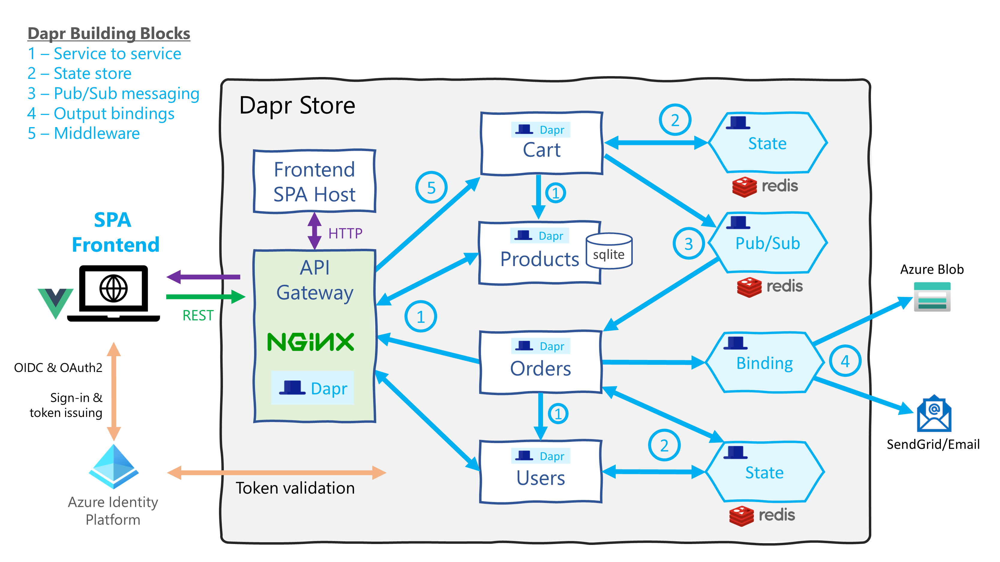

# Dapr Store

This is a sample application showcasing the use of [Dapr](https://dapr.io/) to build microservices based systems

It is written in a mixture of Go and Vue.js



## Quick guide local (WSL/Linux only)
Install and init Dapr
```
wget -q https://raw.githubusercontent.com/dapr/cli/master/install/install.sh -O - | /bin/bash
sudo dapr init
```

## Local ports
9000 - NGINX API gateway
9001 - Orders service
8000 - Frontend host
